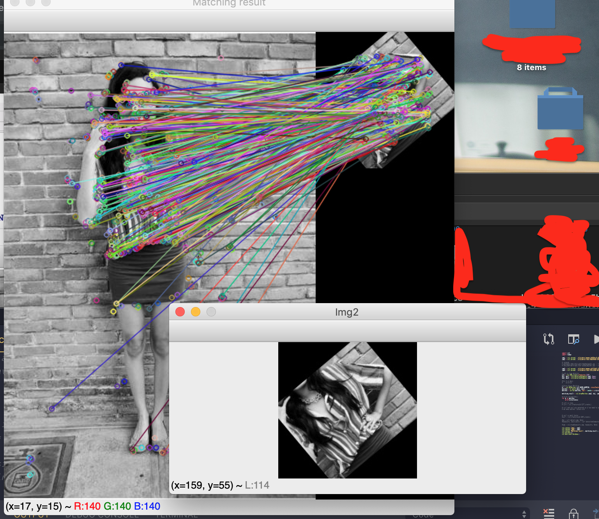
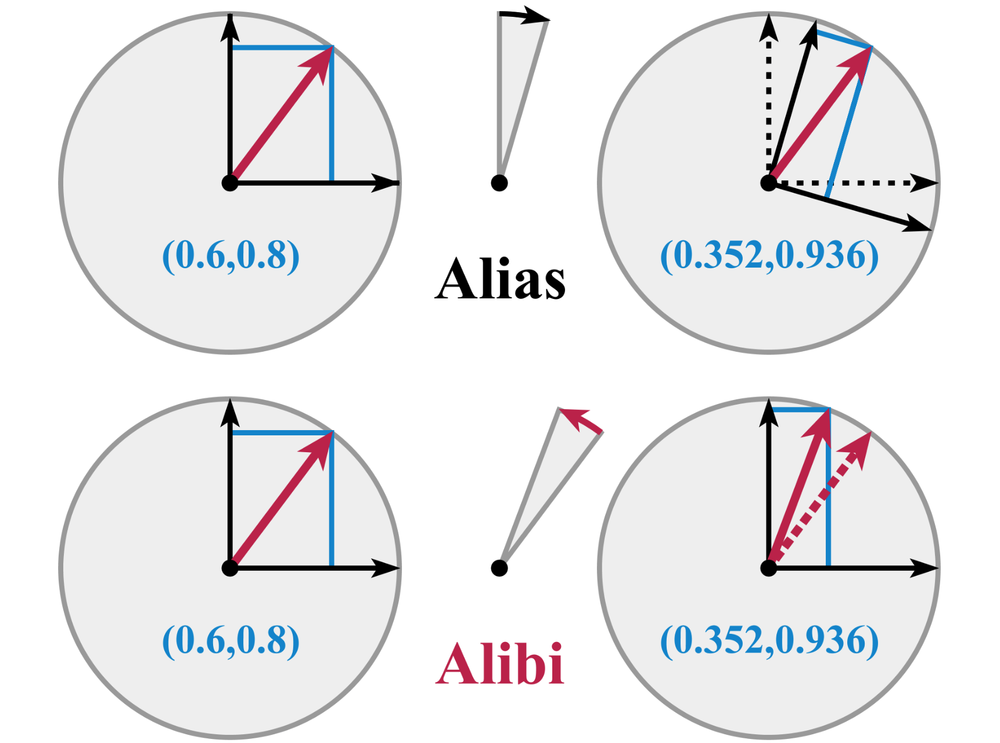

### Instructions :- 

Time Complexity is m(cropped_images) * n(actual_images):

Although as soon as it finds a mathch it breaks the loop so technically there aren't m*n comparsions but worst-case scenario O(mxn)

##### Downloading data

```
> ./download.sh
```

This will download images in images and crops directory in root

###### Ideas:
1) How to speed up search with two nested for loops?
   - Image search using heuristic methods
   - Every full image is a cluster
   - normal euclidean distance

2) GANs for image reformation: https://dmitryulyanov.github.io/deep_image_prior

But than I realised that GANs would be very costly

-------------------------

Augmentator for rotated and skewed images: https://augmentor.readthedocs.io/en/master/userguide/mainfeatures.html

Rotate and image frame by frame and create a dataset to match it with original image...But would introduce too much complexity 

----------------------------
## For straight images: plain_search.py
template_matching

## For noisy images: noise_removal.py 
used median blur algorithm....since I saw noise was mostly of same kind & there was pattern in that

## Rotation(Problem) and my approach: Augmentation.py  

The procedure is the following more or less.
1) Execute feature detection in both images.
2) Matching the extracted features.
2a) OPTIONAL: I can remove some of the outliers using the Lowe's ratio test. I can find it in a lot of implementation, it is really simple to implement it.
3) I'll get 2 sets, obj and scene, or left and right, whatever: the sets contains the coordinate of matching points. I can extract the coordinate directly from the keypoints, in python is the following:
```
    for m in goodMatch:
        tp.append(tkp[m.queryIdx].pt)
        qp.append(qkp[m.trainIdx].pt)
```
4) Once I have this two sets, then I can find the homography that I should apply to the cropped image in order to get correspondence with the original image. I can call findHomography giving the two sets, and I can run using RANSAC to get even better result and avoid most of the outliers.
5) Once I've done this, to get the coordinate I can to do a simple thing: Simply create an array inserting the coordinate of the top left corner and right bottom corner from the cropped image. Then call perspectiveTransofrm using the array I just created and give the previously found Homography matrix. In the resulting array I'll find the coordinate of the corner in the original image.

---------------------------
code is in file: Augmentation.py 
---------------------------------------------

but it's not working for all images. It breaks in middle....There was some bug I got stuck at: https://github.com/opencv/opencv/issues/5937

## I could fix it in given time --- I have a full time job sorry :( ....I needed more time

Roated images approach I followed 




..............

## So right now only noise and template matching functionality is working which creates res.json file


# For Rotation one Approach I can think of

- Compute the theta and create a Rotation matrix using it. (https://en.wikipedia.org/wiki/Rotation_matrix)
- Now I create the rectangle with the point x0, x1, x2, x3 as top left corner (0,0) , top right corner (width, 0), bottom right corner (width, height), bottom left corner (0,height) (maybe I have to subtract 1 since opencv start from 0,0)
- After that I apply perspective transform using the computed rotation matrix and the points above (so I get the corner point in the cropped rotated image)
- After that I apply perspective transform using the Homography matrix.
- In this way should work I think....If not then the point need to be traslated also



